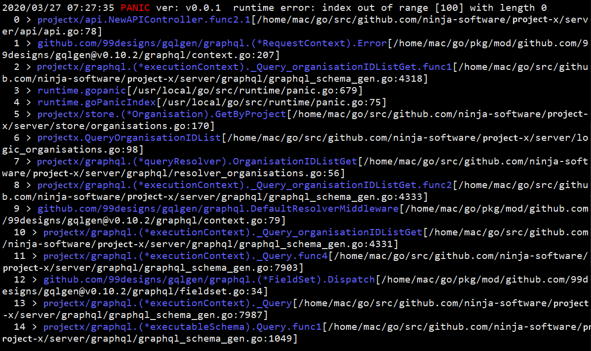

# Terror

## Keeping program terror in check, reveal where go code exploded 💥

Go stacktrace sometimes are hard read and figure out, especially when it is very nested.

Sometimes you just want to error message and their location without all the noise. This helps you to do that.

### Changelog

v2 introduce callbacks for various error level, warn/error/panic, removed `.New()` and added `.Warn()` `.Error()` `.Panic()` for each respective error level.

### Install

`go get github.com/ninja-software/terror/v2`

### Usage

Prepare error:

```go
package main

import (
	"net/http"

	"github.com/ninja-software/terror/v2"
)

func getSite() error {
	_, err := http.Get("http://example.commm/")
	if err != nil {
		return terror.Error(err)
	}
	return nil
}

func main() {
	err := getSite()
	if err != nil {
		terror.Echo(terror.Error(err))
		return
	}
}

```

### Note

Always wrap error using `.Warn()` or `.Error()` or `.Panic()` or it will not have trace info. E.g.

```go
return terror.Error(terror.ErrBadContext, "")  // good
```

not

```go
return terror.ErrBadContext  // bad
```

Blank string like `terror.Error(err, "")`, will default to use err.Error() string.

### Output



```

```

### Examples

For more indepth example, look inside example folder
